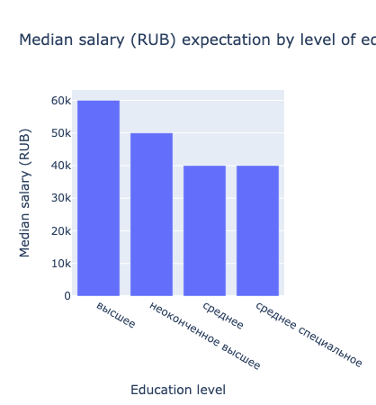
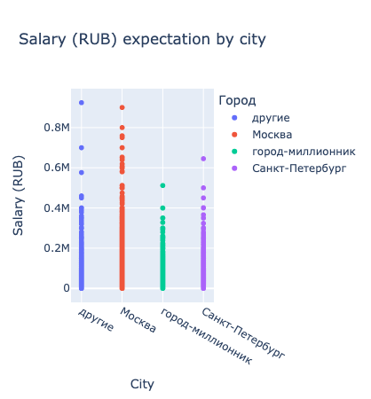
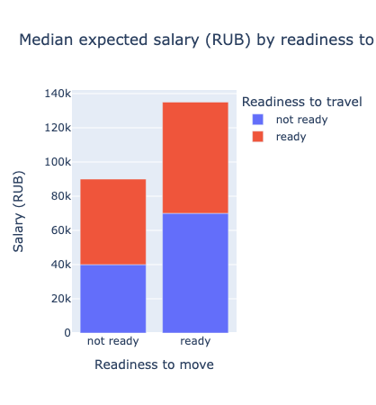
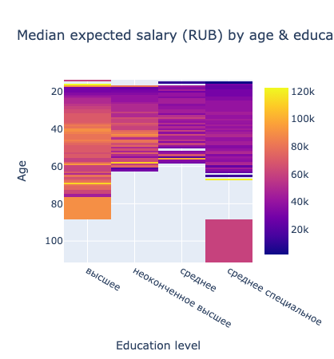
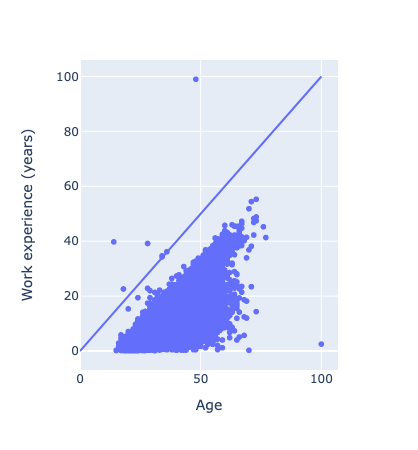
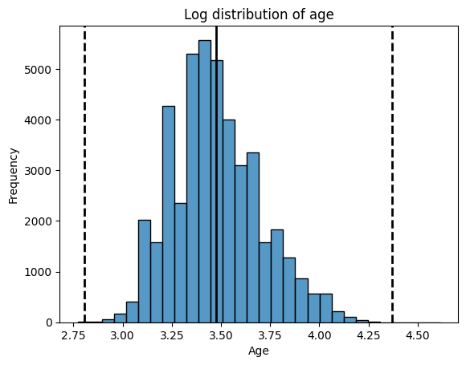

# HeadHunter CV data analysis

## Overview

This project is focused on analysing a dataset of CVs from a job search platorm HeadHunter.

The analysis steps include:

1. Exploring data
2. Transforming data and engineering useful features
3. Visualizing resulting data and looking for dependencies
4. Cleaning data by removing duplicates and outliers using **three-sigma rule** and **logarithmic Z-score**

The outcome of the project is a dataset prepared to be used as a part of the training sample for various ML models such as linear or logistic regression for predicting certain outcomes such as **what is a competitive salary for a candidate with specific experience and requests**.

## Datasets

### [CVs dataset](https://drive.google.com/file/d/1Kb78mAWYKcYlellTGhIjPI-bCcKbGuTn/view?usp=sharing)

- `Пол` -> `Gender`
- `возраст` -> `Age`
- `ЗП` -> `Salary` (desired salary in RUB)
- `Ищет работу на должность` -> `Desired position`
- `Город` -> `City`
- `переезд` -> `Relocation` (readiness to relocate)
- `командировки` -> `Travel` (readiness to travel)
- `Занятость` -> `Availability` (full-time, part-time etc.)
- `График` -> `Schedule` (workdays schedule)
- `Опыт работы` -> `Experience`
- `Последнее/нынешнее место работы` -> `Last/current company`
- `Последняя/нынешняя должность` -> `Last/current position`
- `Образование и ВУЗ` -> `Level of education and university`
- `Обновление резюме` -> `CV last updated on`
- `Авто` -> `Car`

### [Currency rates dataset for bringing expected salary to the same currency](https://lms-cdn.skillfactory.ru/assets/courseware/v1/15abf80f45a2f3e93c3274101b451c67/asset-v1:SkillFactory+DST-3.0+28FEB2021+type@asset+block/ExchangeRates.zip)

- `currency`
- `per` (time interval of the measurement - e.g. 'D' is a day)
- `date`
- `time`
- `close` (closing price in RUB)
- `vol` (trading volume)
- `proportion` (how many units of the currency the `close` price involve. E.g. if `close` for USD $= 120$ and `proportion` $= 2$, then the USD<>RUB rate is $120 / 2 = 60$)

## Data visualization examples

### Median salary (RUB) expectation by level of education

Candidates with higher education expect the highest salary, while the general and special school grads expect to be paid the lowest. In the middle, there are people who didn't yet finish their higher education.

### Salary (RUB) expectation by city

Candidates in Moscow expect the highest pay check while candidate expectations in other cities are distributed similarly.

### Median salary (RUB) expectation by readiness to relocate & travel

The highest expected salary is amongts candidates who are willing to relocate byt not willing to travel for business trips. The second highest are professionals who are ready to do both, with the lowest expected salary observed in the segment of those whoe aren't ready to relocate or travel.

### Median salary (RUB) expectation by age and education level

Amongst the candidates with higher degree, there seems to be a trend that the salary expectations grow with the age, which is quite logical.

At the same time, professionals between 18 and 22 years old hold similar salary expectations regardless of their education level. That can be potentially explain by their focus on getting experience rather than a high pay check.

### Work experience VS age

We can clearly see 7 outliers whose work experience is larger or equal to their age (impossible).

## Data cleaning example

### Removing outliers by age

Since the age distribution had a shape similar to logarithmic, I logarithmically scaled this feaure and used the 3-sigma rule to find potential outliers.

After than, I ran a Z-score analysis to verify and remove the outliers by their age.

## Tech stack

### Language & version

- [Python 3.8.10](https://www.python.org/downloads/release/python-3810/)

### Data analysis

- [Pandas 2.0.3](https://pandas.pydata.org/)
- [Numpy 1.24.4](https://numpy.org/)

### Data visualization

- [Matplotlib 3.7.5](https://matplotlib.org/)
- [Seaborn 0.13.2](https://seaborn.pydata.org/)
- [Plotly 5.18.0](https://plotly.com/)
